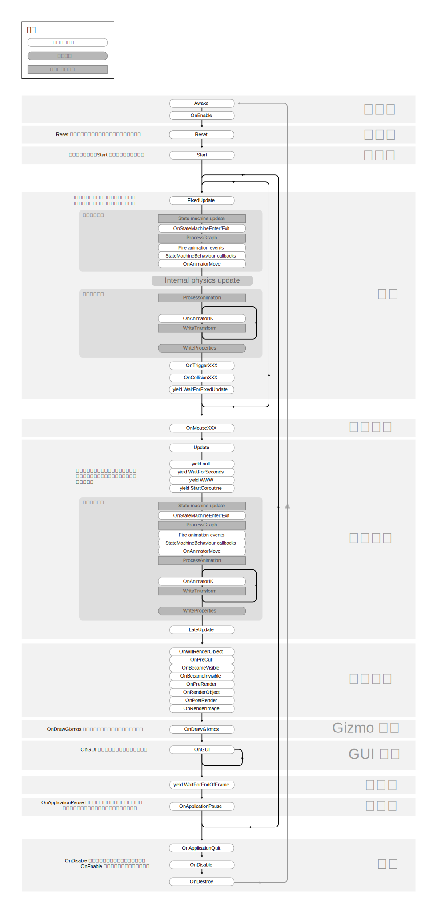

# 事件方法的执行顺序 Order of Execution for Event Functions

要运行一个 Unity 脚本，需要在预先决定好的顺序执行一系列的事件方法。这一页描述了这些事件方法以及他们是如何放进执行序列中的。

## 脚本生命周期概览 Script lifecycle overview

下面的表格总结了 Unity 如何在一个脚本的生命周期中安排和重复事件方法的。

要获取关于这么多事件方法的更多的信息，看看下面的章节：

## 脚本生命周期流程图

*Ctrl+点击 以查看大图*

**注意：** 部分浏览器不支持 SVG 图像文件。如果上面的图像显示不出来，那是时候加入 [Mozilla Firefox](https://www.mozilla.org/) 了。

## 第一次场景加载 First Scene load

这一些方法在 **scene**(场景) 开始时被调用（每个场景中的对象调用一次）

- **Awake**：这个方法总是在所有 Start 方法执行之前和所有 **prefab**(预制件) 实例化之后被调用。（如果在启动之前 GameObject 没有激活，Awake 不会被调用直到他被激活）
- **OnEnable**：（只在对象被激活的时候调用）：这个方法会在对象被启用之后马上被调用。这会在 MonoBehaviour 实例被创建的时候发生，比如当一个关卡被加载，或者一个添加了这个脚本组件的 **GameObject** 被实例化之后。
- **OnLevelWasLoaded**：这个方法在一个关卡被完全加载的时候被调用。

注意对于所有加入到场景中的对象，所有脚本的 Awake 和 OnEnable 方法会在 Start、Update 等等任何其他方法被调用之前调用。一般情况下在游戏过程中对象被实例化不会被调用 Awake 和 OnEnable 方法。

## 编辑器 Editor

- **Reset**：Reset 在第一次添加到对象的时候和在运行 *Reset* 命令的时候被调用来初始化脚本的属性。

## 在第一次帧更新之前 Before the first frame update

- **Start**：Start 只在脚本实例被激活的时候在第一次帧更新之前被调用。

对于加到场景中的对象，Start 方法会在 Update 等方法调用之前在所有脚本中被调用。自然的，在游戏过程中对象被实例化不会调用这个方法。

## 在两帧之间 In between frames

- **OnApplicationPause**：这个方法在暂停被检测到的那一帧末尾被调用，实际上就是两次正常帧更新之间。在 **OnApplicationPause** 被调用之后，会添加一个额外帧来允许游戏显示暂停状态的图形。

## 更新顺序 Update Order

当你在保持跟踪游戏的逻辑、互动、动画、相机位置和等等其他的东西，有几个不同的事件可以使用。最常见的形式是在 Update 方法中完成大部分工作，但你也有别的方法可以用。

- **FixedUpdate**：**FixedUpdate** 一般比 **Update** 调用得更加频繁。如果帧率很低，它可以在一帧中被调用几次，同时在帧率很高的时候可以一次都不被调用。所有物理计算和更新在 **FixedUpdate** 之后会马上发生。在 **FixedUpdate** 里计算移动距离的时候，你不需要把你的值乘上 **Time.deltaTime**。这是因为 **FixedUpdate** 被可靠的计时器定时调用，独立于帧率。
- **Update**：**Update**每帧都被调用一次。这是帧更新的主要函数。
- **LateUpdate**：**LateUpdate** 每帧调用一次，在 **Update** 被调用之后。任何在 **Update** 中的计算在 **LateUpdate** 开始之前都会完毕。常见的 **LateUpdate** 用法是一个第三人称跟踪相机。如果你在 **Update** 里计算角色的移动和旋转，你可以在 **LateUpdate** 里计算相机的移动和旋转。这会保证角色在相机跟踪他的位置时已经移动完毕了。

## 未完成 动画更新循环 Animation update loop

> QAQ 我真的看不懂这两节啊，可能是我没看过动画系统部分的原因？  
> 希望有人能帮我看一下……[在这](https://docs.unity3d.com/Manual/ExecutionOrder.html)

这些方法和分析器标记会在 Unity 评估动画系统的时候被调用。

- **OnStateMachineEnter**：在 **State Machine Update**(状态机更新) 阶段，这一个

  这个回调函数只在动画图表包含了一个控制器组件（比如[AnimatorController](https://docs.unity3d.com/ScriptReference/Animations.AnimatorController.html)、[AnimatorOverrideController](https://docs.unity3d.com/ScriptReference/AnimatorOverrideController.html) 或 [AnimatorControllerPlayable](https://docs.unity3d.com/ScriptReference/Animations.AnimatorControllerPlayable.html)）的时候被调用。

  **注意：** 把这个回调函数添加到  [StateMachineBehaviour](https://docs.unity3d.com/ScriptReference/StateMachineBehaviour.html) 组件会禁用多线程评估 **state machine**(状态机)。
- **OnStateMachineExit**：在

  这个回调函数只在动画图表包含了一个控制器组件（比如[AnimatorController](https://docs.unity3d.com/ScriptReference/Animations.AnimatorController.html)、[AnimatorOverrideController](https://docs.unity3d.com/ScriptReference/AnimatorOverrideController.html) 或 [AnimatorControllerPlayable](https://docs.unity3d.com/ScriptReference/Animations.AnimatorControllerPlayable.html)）的时候被调用。

  **注意：** 把这个回调函数添加到  [StateMachineBehaviour](https://docs.unity3d.com/ScriptReference/StateMachineBehaviour.html) 组件会禁用多线程评估 **state machine**(状态机)。
- **Fire Animation Events**：
- **StateMachineBehaviour (OnStateEnter/OnStateUpdate/OnStateExit)**：

## 未完成 Useful profile markers

## 渲染 Rendering

- **OnPreCull**：在相机挑选场景中显示的对象时被调用。选择决定了什么对象对于相机是可见的。OnPreCull 在挑选发生前一刻被调用。
- **OnBecameVisible/OnBecameInvisible**：在某个对象对于任何相机变得可见/不可见时被调用。
- **OnWillRenderObject**：对于任何相机可见的时候调用**一次**。
- **OnPreRender**：在相机开始渲染场景的时候被调用。
- **OnRenderObject**：在所有定期场景渲染完成之后被调用。你可以在这里使用 [GL](https://docs.unity3d.com/ScriptReference/GL.html) 类或者 [Graphics.DrawMeshNow](https://docs.unity3d.com/ScriptReference/Graphics.DrawMeshNow.html) 来画自定义的几何图形。
- **OnPostRender**：在一个相机完成渲染场景之后。
- **OnRenderImage**：在场景渲染完毕以允许图像开始进行 **post-processing**(传递过程)，查看 [ Post-processing Effects](https://docs.unity3d.com/Manual/PostProcessingOverview.html)。
- **OnGUI**：每帧调用多次来对 GUI 事件进行响应。Layout(布局) 和 Repaint(重绘) 事件最先处理，接着是每一次输入的 Layout 和键盘/鼠标事件。
- **OnDrawGizmos**：用来绘画**场景窗口** 中的 **Gizmos** 来实现可视化需求。

## 协同函数 Coroutines

普通的协同函数更新在 Update 方法返回后运行。协同函数是可以暂停执行（yield(中断)）直到给定的中断指令完成。不同的协同函数使用：

- **yield** 协同函数会在所有 Update 更新在下一帧被完成调用继续进行。
- **yield WaitForSeconds** 在特定的延时后的协同函数，在这帧所有 Update 方法被调用之后被调用。
- **yield WaitForFixedUpdate** 在所有脚本的 FixedUpdate 被调用之后的协同函数。
- **yield WWW** 在一个 WWW 下载完成之后的协同函数。
- **yield StartCoroutine** 把协同函数连接起来，并且等待 MyFunc 协同函数完毕。

## 当对象被摧毁 When the Object is destroyed

- **OnDestroy**：这个方法在这个对象存在的最后一帧中所有的帧更新完成之后被调用（对象可能会在这时作为对对象的响应被摧毁，也可能在场景关闭时被摧毁）。

## 当退出时 When quitting

这些方法会在所有场景中的活动对象上被调用。

- **OnApplicationQuit**：这个方法会在程序退出前在所有游戏对象上被调用。在编辑器中这在用户停止播放模式时发生。
- **OnDisable**：这个方法在行为(behaviour)被禁用或非激活时被调用。
